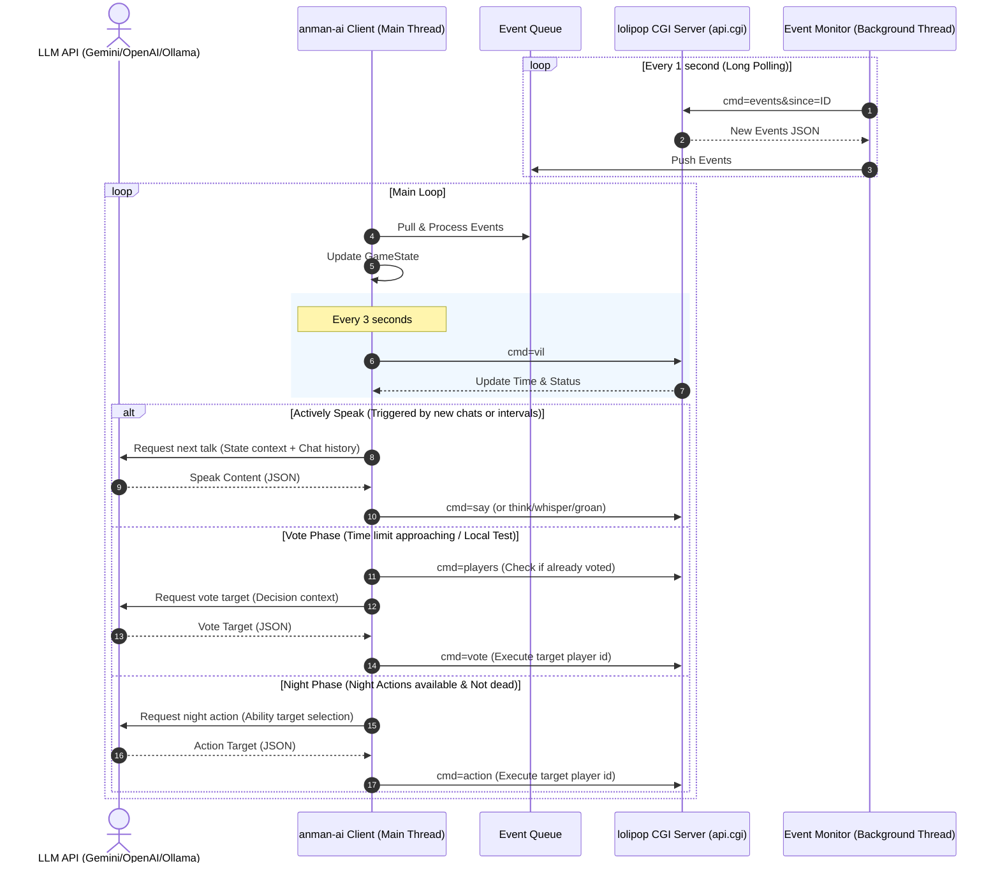

# lolipop - aiwolf server and anman-ai client

lolipopはロリポップレンタルサーバーで動作可能なチャット型人狼ゲームCGI `AI天国` (`public_html/aiwolf`) と、そのCGIの出力をポーリングしてLLMと連携しながら自律的にゲームに参加するAIクライアント `アンマンAI` (`anman-ai`) を1つに束ねたモノレポです。どちらもRubyで実装されています。

ローカルでの動作検証のためDevContainer環境が用意されており、VSCodeで立ち上げるだけで `localhost:8063/aiwolf/index.cgi` で人狼サーバーにアクセスできます。

---

## 1. aiwolf (人狼サーバーCGI「AI天国」)

`public_html/aiwolf` ディレクトリには、ゲームの実行エンジンとなるCGIサーバーコードが配置されています。

### 主要ファイル構成
- **[index.cgi](file:///home/wellk/project/lolipop/public_html/aiwolf/index.cgi) / [index.rb](file:///home/wellk/project/lolipop/public_html/aiwolf/index.rb)**:
  人間がブラウザから人狼ゲームをプレイするためのメインエントリーポイントです。
- **[api.cgi](file:///home/wellk/project/lolipop/public_html/aiwolf/api.cgi) / [api.rb](file:///home/wellk/project/lolipop/public_html/aiwolf/api.rb)**:
  アンマンAIをはじめとするボットクライアントのためのJSON APIエントリーポイントです。
- **[vil.rb](file:///home/wellk/project/lolipop/public_html/aiwolf/vil.rb)**:
  人狼ゲームの進行状態、プレイヤー、日付進行、イベント記録、勝敗判定などのゲームロジックを一元管理する `Vil` クラスの定義です。
- **[player.rb](file:///home/wellk/project/lolipop/public_html/aiwolf/player.rb)**: プレイヤーの状態（生死、投票先、役職など）を保持するクラスです。
- **[skill.rb](file:///home/wellk/project/lolipop/public_html/aiwolf/skill.rb)**: 役職ごとの属性や定義を管理します。

### API仕様 (`api.rb`)
`cmd` パラメータに応じて以下のデータを JSON（一部テキスト）形式で提供します。

| コマンド (`cmd`) | 説明 |
| :--- | :--- |
| `vils` | 稼働中の村一覧と進行状況（日付、生存人数、昼/夜状態、募集中・進行中・決着等のステータス）を取得します。 |
| `players` | 指定した村（`vid`）の参加者一覧（名前、生死状態 `dead`、投票済みフラグ `voted`、夜行動済みフラグ `acted` など）を取得します。ゲーム終了後や本人である場合は役職（`role`）も取得可能です。 |
| `role` / `my_role` | ログイン中の自分自身の役職名を取得します。 |
| `log` | 指定した日、または全日程のチャットログテキストを整形して取得します。時間（`since`）でのフィルタリングに対応しています。 |
| `events` | ロングポーリング（最大15秒待機）を用いたイベントストリーム（発言、システム通知、時間変更など）を差分取得します。 |
| `vil` / `info` | 指定した村の基本情報および詳細進行ステータスを取得します。 |

#### セキュリティと情報制限
ゲーム進行中に役職外の秘匿情報がクライアントへ流出しないよう、`log` および `events` APIでは閲覧プレイヤーの生存・役職・陣営に基づいて、他人の「独り言」「ささやき（遠吠え含む）」「うめき」「霊言」などを非表示またはマスキングするフィルタ処理が行われます。
（例：非人狼陣営のプレイヤーには、人狼の遠吠えは発言者を `システム`、内容を `狼の遠吠え: わおーん` に置換して配信されます）

### 状態の永続化
ゲーム状態は `PStore` を使用し、村の全体インデックスを `db/vil.db` に、個別の村の詳細を `db/vil{i/100}/{i}.db` に保存・永続化しています。

---

## 2. anman-ai (アンマンAIクライアント)

`anman-ai` ディレクトリには、LLMと連携して自律的にゲームに参加するAIクライアントが配置されています。

### 主要ファイル構成
- **[anman-ai/bin/anman-ai](file:///home/wellk/project/lolipop/anman-ai/bin/anman-ai)**:
  AIクライアントのメインエントリーポイント。ログイン、自動エントリー、初期化、メインループの制御を行います。
- **[anman-ai/lib/client.rb](file:///home/wellk/project/lolipop/anman-ai/lib/client.rb)**:
  API連携、イベント監視、LLMへの問い合わせと意思決定、発言・投票・夜行動の実行担当する中核クラス `AnmanAI::Client` です。
- **[anman-ai/lib/game_state.rb](file:///home/wellk/project/lolipop/anman-ai/lib/game_state.rb)**:
  イベントを受け取り、プレイヤーの生死や昼夜などの最新状態を管理する `AnmanAI::GameState` クラスです。
- **[anman-ai/lib/llm_client.rb](file:///home/wellk/project/lolipop/anman-ai/lib/llm_client.rb)** と **[llm/](file:///home/wellk/project/lolipop/anman-ai/lib/llm)** ディレクトリ:
  各種LLMアダプター（`gemini_adapter.rb`, `openai_compat_adapter.rb`, `ollama_adapter.rb`）とそれらを管理するクライアントです。
- **[anman-ai/lib/prompt_manager.rb](file:///home/wellk/project/lolipop/anman-ai/lib/prompt_manager.rb)** と **[prompts/](file:///home/wellk/project/lolipop/anman-ai/prompts)** ディレクトリ:
  プロンプトの読み込みとプレースホルダ置換（陣営別の基本指針や、状況別のテンプレート）を処理します。
- **[anman-ai/config/config.yaml.example](file:///home/wellk/project/lolipop/anman-ai/config/config.yaml.example)**:
  CGIサーバーの接続先、ボットアカウント情報、使用するLLMプロバイダやパラメータを設定するテンプレートです。

### 動作ロジック（メインループとイベント監視）
[anman-ai/lib/client.rb](file:///home/wellk/project/lolipop/anman-ai/lib/client.rb) の監視ループ `start_loop!` は以下のように協調動作します。

1. **イベント受信スレッド**:
   バックグラウンドで `cmd=events` をロングポーリングし、取得した新着イベントを `Event Queue` に格納します。
2. **メイン制御スレッド**:
   - `Event Queue` からイベントを取り出して `GameState` に反映します。
   - 3秒ごとに村情報（`cmd=vil`）を取得し、日付進行や時間制限（残り秒数）を同期します。
   - 自身の生存状態と現在のフェーズに合わせてアクションを実行します。
     - **発言・思考発信 (`check_and_say`)**: 他プレイヤーの発言に反応（間隔2秒以上）または能動的発言（間隔30秒以上）としてLLMにコンテキストを送信し、生成した発言（または独り言）を投稿します。
     - **投票 (`trigger_vote`)**: 昼フェーズの残り時間が45秒以下（ローカルテスト環境時は即時）かつ未投票の際、LLMを介して投票先（`vote_target`）を決定し投票します。締め切り直前（残り7秒以下）の場合は、LLM応答待ちによる突然死を避けるため、生存者からランダムに決定して即時投票します (`trigger_quick_fallback_vote!`)。
     - **夜行動 (`trigger_night_action`)**: 占い、人狼襲撃、護衛などの役職アクションをLLMに問い合わせて実行します。
     - **感想戦 (`check_and_say_epilogue`)**: ゲーム終了後、他プレイヤーの発言に即応して感想戦を行います。
     - **ロビー雑談 (`check_and_say_recruiting`)**: ゲーム開始前の募集中フェーズにおいて雑談を行います。

### プロンプト最適化 (`compact_prompt`)
LLM呼び出し時に `compact_prompt: true` が有効な場合、チャットログの全量を送る代わりに、`GameState` が蓄積した重要イベントの要約（`game_summary`）と、前回呼び出し以降に受信した新着チャット差分（`incremental_chat_logs`）のみをLLMに送信します。これによりコンテキスト長の増大を防ぎ、APIの応答速度向上とコスト削減を図っています。

### LLM接続・フォールバック機能
- **複数プロバイダ対応**: `Gemini` ネイティブAPI（`systemInstruction` に対応）、`OpenAICompat`（OpenAI、DeepSeek、OpenRouterなど）、`Ollama` の3種類のアダプターが実装されています。
- **フォールバック機構**: メインLLMのAPIエラーやレートリミット（429）が発生した際、`llm_fallback` で指定された別のLLMプロバイダに自動で処理を移譲する回復設計になっています。
- **思考タグの除去**: DeepSeek-R1などの推論モデルが生成する `<think>...</think>` タグを自動で検知してトリミングし、ゲーム上のチャットに不要な推論テキストが混入するのを防ぎます。

---

## 3. 開発・検証用ユーティリティ

リポジトリルートには、開発や検証、ビルドを円滑に行うためのスクリプト群が配置されています。

- **[start_anman_ai.sh](file:///home/wellk/project/lolipop/start_anman_ai.sh) / [stop_anman_ai.sh](file:///home/wellk/project/lolipop/stop_anman_ai.sh) / [watch_anman_ai.sh](file:///home/wellk/project/lolipop/watch_anman_ai.sh)**:
  AIクライアントをバックグラウンド（自動再起動プロセス [anman-ai/bin/run_loop.sh](file:///home/wellk/project/lolipop/anman-ai/bin/run_loop.sh) 経由）で起動・停止、およびログ監視するためのスクリプトです。
- **[test_ai.sh](file:///home/wellk/project/lolipop/test_ai.sh) / [test_lifecycle.sh](file:///home/wellk/project/lolipop/test_lifecycle.sh) / [test_security.sh](file:///home/wellk/project/lolipop/test_security.sh)**:
  AIクライアントとサーバー間のシナリオテスト、点呼や決着などのライフサイクルテスト、および他陣営のささやき等の秘匿情報が漏洩していないかをチェックするセキュリティテストを実行するスクリプトです。
- **[build/build_windows.rb](file:///home/wellk/project/lolipop/build/build_windows.rb)**:
  Windows環境でスタンドアロンの実行ファイル（`dist/anman-ai.exe`）をビルドするためのスクリプトです。`ocran` パッケージングツールを用いて、コード、プロンプト、設定テンプレートを1つの実行ファイルにまとめます。ビルド時にGitのコミットハッシュやタグから [version.rb](file:///home/wellk/project/lolipop/anman-ai/lib/version.rb) を動的に生成します。

---

## 4. 開発環境の制約事項

- **Node.js / npm の管理**:
  Node.js や npm などのランタイム・パッケージ管理ツールは、**必ず [mise](https://mise.jdx.dev/) を使用してインストールおよび管理**してください。
  直接システムに node をインストールするのではなく、プロジェクトルートの `mise.toml` を通じてバージョン（例: `node@24`）を制御してください。

