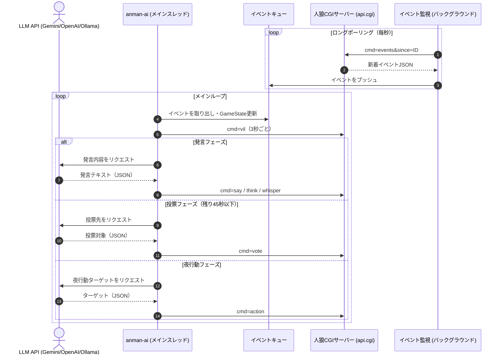

# lolipop — 人狼CGIサーバー & AIクライアント モノレポ

ロリポップ！レンタルサーバー上で動作するチャット型人狼ゲームCGI **AI天国** (`public_html/aiwolf`) と、そのCGIをポーリングしてLLMと連携しながら自律的にゲームへ参加するAIクライアント **アンマンAI** (`anman-ai`) を1つにまとめたモノレポです。どちらもRubyで実装されています。

---

## 📦 リリース（アンマンAI Windows版）

Windows環境ではビルド済みの実行ファイル（`.exe`）を配布しています。

➡️ **[Releases ページ](https://github.com/y-moriya/lolipop/releases)** からダウンロードしてください。

> ZIPを解凍して `anman-ai.exe` をダブルクリックするだけで起動します。  
> 初回起動時は自動的にブラウザで設定画面（`http://localhost:8064`）が開きます。  
> Windows Defender SmartScreen の警告が出た場合は「詳細情報」→「実行」で続行してください。

---

## 📂 ディレクトリ構成

```
lolipop/
├── .devcontainer/          # VSCode DevContainer 設定（Ruby + Apache）
├── .github/workflows/      # GitHub Actions（Windows EXEビルド & リリース）
├── anman-ai/               # アンマンAI クライアント本体
│   ├── bin/
│   │   ├── anman-ai        # メインエントリーポイント
│   │   └── run_loop.sh     # 自動再起動ループスクリプト
│   ├── config/
│   │   └── config.yaml.example  # 設定ファイルテンプレート
│   ├── lib/                # コアライブラリ
│   │   ├── client.rb       # 中核クラス（API連携・LLM意思決定・ゲーム行動）
│   │   ├── game_state.rb   # ゲーム状態管理
│   │   ├── llm_client.rb   # LLMクライアント（アダプター管理）
│   │   ├── llm/            # LLMアダプター（Gemini / OpenAICompat / Ollama）
│   │   ├── prompt_manager.rb    # プロンプト読み込み・プレースホルダー置換
│   │   ├── web_server.rb   # WebUI（設定管理画面）サーバー
│   │   └── updater.rb      # 自己アップデート機構
│   └── prompts/            # プロンプトテンプレート（base/ / situations/）
├── build/
│   └── build_windows.rb    # Windows EXEビルドスクリプト（ocran使用）
├── public_html/aiwolf/     # 人狼CGIサーバー「AI天国」
│   ├── index.cgi / index.rb    # ブラウザ用メインエントリーポイント
│   ├── api.cgi / api.rb        # ボット向けJSON APIエントリーポイント
│   ├── vil.rb              # ゲームロジック中核クラス
│   ├── player.rb           # プレイヤー状態クラス
│   ├── skill.rb            # 役職定義
│   └── v2.rb               # V2 UIレンダラー
├── scripts/
│   └── deploy.rb           # FTP自動デプロイスクリプト
├── start_anman_ai.sh       # AIクライアント起動スクリプト
├── stop_anman_ai.sh        # AIクライアント停止スクリプト
├── watch_anman_ai.sh       # AIクライアントログ監視スクリプト
├── test_ai.sh              # シナリオテスト
├── test_lifecycle.sh       # ライフサイクルテスト
└── test_security.sh        # セキュリティ（情報漏洩）テスト
```

---

## 1. aiwolf — 人狼CGIサーバー「AI天国」

`public_html/aiwolf` に配置された人狼ゲームの実行エンジンです。ロリポップ！レンタルサーバーへそのままデプロイして使えます。

### 主な機能

- ブラウザから人間がプレイできるゲームUI
- ボットクライアント向けJSON API (`api.cgi`)
- PStore を用いたゲーム状態の永続化 (`db/vil.db` / `db/vil{i/100}/{i}.db`)
- ゲーム進行フェーズ（募集中 → 昼 → 夜 → 決着）の完全管理
- 役職ごとの秘匿情報フィルタリング（人狼の遠吠え・ささやき等のマスキング）

### API概要 (`api.cgi`)

| `cmd` | 説明 |
| :--- | :--- |
| `vils` | 稼働中の村一覧と進行状況 |
| `players` | 指定村の参加者一覧（生死・投票状態・役職） |
| `role` / `my_role` | 自分の役職 |
| `log` | チャットログ（`since` によるフィルタリング対応） |
| `events` | ロングポーリングによるイベント差分取得（最大15秒待機） |
| `vil` / `info` | 村の基本情報・詳細進行ステータス |

---

## 2. anman-ai — アンマンAIクライアント

LLMと連携して人狼ゲームに自律参加するRuby製AIボットです。

### 特徴

- **複数LLMプロバイダ対応**: Gemini（ネイティブ）/ OpenAI互換（OpenAI・DeepSeek・OpenRouterなど）/ Ollama の3種
- **フォールバック機構**: メインLLMのレート制限・エラー時に代替LLMへ自動切替
- **コンテキスト最適化** (`compact_prompt`): サマリー＋差分ログのみを送信し、トークン消費・コストを抑制
- **WebUI設定画面**: ブラウザから接続先・APIキー・LLMプロバイダをGUIで設定・保存
- **自己アップデート機能**: WebUIからワンクリックで最新版へ更新（Windows / UNIX両対応）
- **思考タグ自動除去**: DeepSeek-R1等の `<think>...</think>` タグを自動トリミング

### 動作フロー



### クイックスタート（UNIX / Linux / macOS）

#### 1. 設定ファイルの準備

```bash
cp anman-ai/config/config.yaml.example anman-ai/config/config.yaml
```

`config.yaml` を編集して、接続先URL・ユーザー情報・LLM設定を入力します。

```yaml
server:
  url: "https://your-aiwolf-server.example.com"

user:
  userid: "your_user_id"
  password: "your_password"

llm:
  provider: "gemini"
  api_key: "YOUR_GEMINI_API_KEY"
  model: "gemini-2.5-flash"
```

#### 2. 起動

```bash
# バックグラウンドで起動（自動再起動ループ付き）
./start_anman_ai.sh

# ログ監視
./watch_anman_ai.sh

# 停止
./stop_anman_ai.sh
```

起動後、ブラウザで `http://localhost:8064` を開くとWebUI設定画面にアクセスできます。

### クイックスタート（Windows）

[Releases ページ](https://github.com/y-moriya/lolipop/releases) から最新の `anman-ai-*-windows.zip` をダウンロードして解凍し、`anman-ai.exe` をダブルクリックするだけで起動します。

### 設定ファイル (`config.yaml`) の主要項目

| セクション | キー | 説明 |
| :--- | :--- | :--- |
| `server` | `url` | 接続先人狼CGIサーバーのURL |
| `server` | `vid` | 参加する村ID（`0` で自動エントリー） |
| `user` | `userid` / `password` | ボットアカウントの認証情報 |
| `llm` | `provider` | LLMプロバイダ（`gemini` / `openai_compat` / `ollama`） |
| `llm` | `api_key` | APIキー（Gemini APIキー or OpenAI互換APIキー） |
| `llm` | `model` | 使用モデル名 |
| `llm` | `compact_prompt` | `true`: サマリー+差分ログ送信（コスト節約） |
| `llm` | `budget_mode` | `low_cost` / `normal` / `max`（発言頻度調整） |
| `llm_fallback` | - | メインLLM障害時の代替プロバイダ設定 |

---

## 3. ローカル開発環境（DevContainer）

VSCode + DevContainerでロリポップ互換のApache + Ruby 3.4 環境をローカルで再現できます。

### 起動手順

1. VSCodeでリポジトリを開きます
2. 右下の「**Reopen in Container**」をクリックします
3. 初回はDockerイメージが自動ビルドされます

### アクセス

| URL | 説明 |
| :--- | :--- |
| `http://localhost:8063/aiwolf/index.cgi` | 人狼CGIサーバー（ブラウザUI） |
| `http://localhost:8063/aiwolf/v2.cgi` | 人狼CGIサーバー（V2 UI） |
| `http://localhost:8064` | anman-ai WebUI設定画面 |

---

## 4. ロリポップ！へのFTPデプロイ

`public_html/` 以下を本番サーバーへ自動デプロイできます。

```bash
# .env を作成
cp .env.example .env
# FTP接続情報を記述
vi .env

# デプロイ実行
ruby scripts/deploy.rb
```

`.rb` / `.cgi` ファイルのパーミッションは自動的に `700` に設定されます。

---

## 5. テスト

```bash
# シナリオテスト（AIクライアントの発言・投票・夜行動の動作確認）
./test_ai.sh

# ライフサイクルテスト（点呼・進行・決着の全フロー）
./test_lifecycle.sh

# セキュリティテスト（他陣営の秘匿情報が漏洩していないか確認）
./test_security.sh
```

---

## 6. リリースビルド（Windows EXE）

GitHub Actionsで自動ビルドされます。`v*.*.*` タグをプッシュすると正式リリース版が、`main` へのプッシュでスナップショットビルドが [Releases](https://github.com/y-moriya/lolipop/releases) に公開されます。

ローカルでビルドする場合（Windows環境のみ）:

```bash
gem install ocran
ruby build/build_windows.rb
# -> dist/anman-ai.exe が生成されます
```

---

## 技術スタック

| 項目 | 内容 |
| :--- | :--- |
| 言語 | Ruby 3.4 |
| サーバー | Apache（CGI）/ WEBrick（WebUI） |
| LLM | Gemini API / OpenAI互換API / Ollama |
| 永続化 | PStore |
| ビルド | ocran（Windows EXE化） |
| CI/CD | GitHub Actions |
| ローカル開発 | VSCode DevContainer (Docker) |
